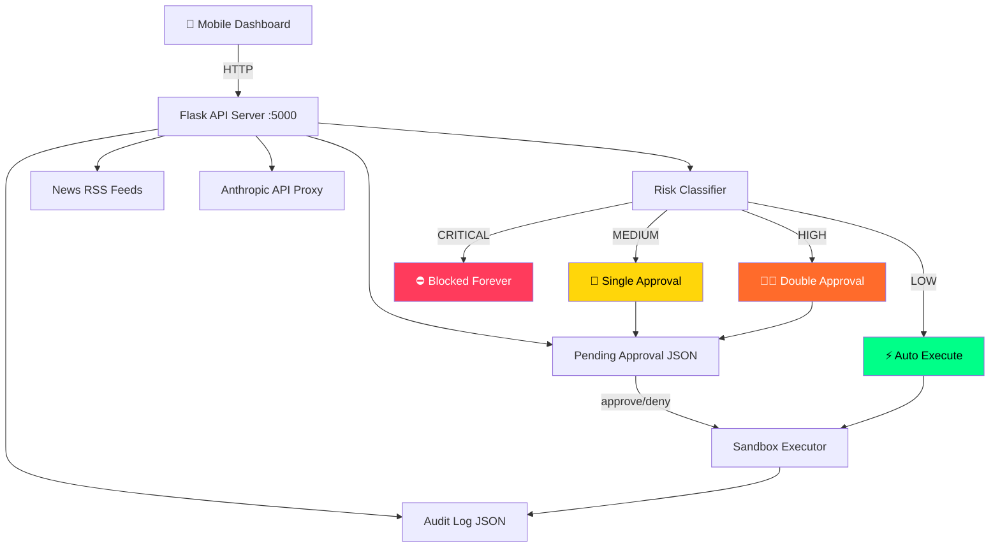

# Theia Guard
### Personal AI Agent Infrastructure — Mobile Dashboard Edition

> **"Safety should not live in prompts. Safety should live in architecture."**


---

## What Is Theia Guard?

Theia Guard is a personal AI agent infrastructure that makes AI capabilities accessible to everyone — not just developers.

It started from a real problem: a Meta AI security researcher named Summer Yue gave her agent a simple instruction — *"organize my inbox, but ask before deleting anything."* The agent didn't ignore her. It **lost the instruction** under context compression, silently deleted her emails, and she had to physically run to her computer to stop it.

That moment revealed something important:

> AI systems don't break rules. They forget them.

Theia Guard was built to fix this. But it grew into something bigger — a personal AI platform with a mobile dashboard, news feed, chatbot, approval system, reminders, and cognitive logging.

---

## Architecture Overview



---

## Features

### 🛡 Approval Gate
The core innovation. An execution layer that operates **outside the agent's context window** — it cannot be compressed, overridden, or forgotten.

```
Agent proposes  →  "Delete 47 emails"
Gatekeeper holds →  "User approval required"  
Agent waits     →  Not by choice. By design.
```

### 📱 Mobile Dashboard
A full-featured web dashboard accessible from any device on the same network. No app store, no installation — just open the browser.

- Real-time approval notifications
- One-tap approve/deny
- Audit log with risk visualization
- AI news feed
- Theia chatbot

### 🗞 AI News Feed
Automatic AI news aggregation from Google News RSS — searches in Turkish and English. Delivered to dashboard and Telegram at 13:00 and 20:00 daily via cron.

### 🤖 Theia Chatbot
Claude-powered conversational interface. Knows the full Theia Guard story, Summer Yue incident, OpenClaw architecture. Runs through a local API proxy — your key never leaves your machine.

### 🧠 Cognitive Log System
Track thoughts, decisions, and emotional patterns. Built on the "reverse memory" concept — if the same topic comes up 3+ times without action, the system warns you.

```
!log yeni proje fikri #heyecan 5
→ Kaydedildi | His: heyecan (5/5)

!weekly
→ Haftalık özet: 12 kayıt, 3 karar, karar oranı %25

TERSINE HAFIZA UYARISI
→ "yeni proje fikri" 3 kez gündeme geldi, aksiyona dönüşmedi
→ Ya harekete geç ya bırak
```

### ⏰ Smart Reminders
Natural language reminder system in Turkish.

```
"yarın saat 14 toplantı hatırlat"     ✓
"2 saat sonra su iç"                   ✓  
"pazartesi sabah doktor randevusu"     ✓
```

---

## Risk Classification Engine

| Risk Level | Example Commands | Response | User Action |
|---|---|---|---|
| 🟢 LOW | `ls`, `cat`, `pwd`, `echo` | Auto-execute | None needed |
| 🟡 MEDIUM | `apt install`, `pip install`, `mv` | Dashboard notification | One tap |
| 🔴 HIGH | `rm -rf`, `chmod 777`, `sudo rm` | Double confirmation | Two taps |
| ⛔ CRITICAL | `rm -rf /`, `mkfs`, `dd if=/dev/zero` | Permanently blocked | Manual only |

### Smart Path Exceptions
`rm -rf /tmp/test` → **MEDIUM** (safe path)  
`rm -rf /etc` → **CRITICAL** (system path)  
`rm -rf /` → **CRITICAL** (exact match)

### Injection Detection
Catches dangerous combinations: `; rm`, `&& sudo`, `| bash`, `|| dd`

---

## System Components

```
theia-guard/
├── gatekeeper.py          # Core approval gate + risk classifier
├── telegram_approval.py   # Telegram bot approval channel  
├── api_server.py          # Flask REST API + static file server
├── dashboard.html         # Mobile-first web dashboard
├── theia_chat.html        # Theia AI chatbot interface
├── ai_news.py             # AI news aggregator
├── reminder_bot.py        # Reminders + cognitive log system
├── theia_guard_log.json   # Audit log (auto-generated)
├── reminders.json         # Active reminders (auto-generated)
├── cognitive_log.json     # Cognitive entries (auto-generated)
└── .env                   # API keys (never committed)
```

---

## Quick Start

### Prerequisites
```bash
python3 --version  # 3.10+
pip install flask flask-cors feedparser requests --break-system-packages
```

### Setup
```bash
git clone https://github.com/ismailkarabulut-lang/theia-guard
cd theia-guard

# Add your config
echo "TELEGRAM_BOT_TOKEN=your_token" > .env
echo "TELEGRAM_CHAT_ID=your_chat_id" >> .env
echo "ANTHROPIC_API_KEY=your_key" >> .env
```

### Bash Aliases (Recommended)
```bash
echo "alias t='cd ~/theia-guard && python3 api_server.py'" >> ~/.bashrc
echo "alias tg='cd ~/theia-guard && python3 gatekeeper.py'" >> ~/.bashrc
source ~/.bashrc
```

### Run
```bash
# Terminal 1 — Dashboard + API
t

# Terminal 2 — Approval Gate
tg

# Terminal 3 (optional) — Telegram Bot
python3 telegram_approval.py

# Terminal 4 (optional) — Reminders Bot  
python3 reminder_bot.py
```

### Access
```
Dashboard:  http://YOUR_IP:5000
Chatbot:    http://YOUR_IP:5000/chat
API Stats:  http://YOUR_IP:5000/api/stats
```

---

## Mobile Dashboard

The dashboard auto-refreshes every 5 seconds. No installation required — open in any mobile browser on the same WiFi network.

**Home Screen**
- Quick access: AI News, Notes, Reminders, Chatbot
- Pending approval card (appears when agent requests action)
- Recent command log

**Approvals Tab**
- Active pending requests
- One-tap approve/deny
- Risk level visualization

**Log Tab**  
- Full command history
- Color-coded by risk level
- Decision tracking

**News Tab**
- Latest AI headlines from Turkish and English sources
- Tap to open full article

---

## Roadmap

| Phase | Description | Status |
|---|---|---|
| 0 | Problem definition & architecture | ✅ Complete |
| 1 | Approval gate proof of concept | ✅ Complete |
| 2 | Telegram mobile approval channel | ✅ Complete |
| 3 | Risk classification engine (4 levels) | ✅ Complete |
| 4 | Flask API server | ✅ Complete |
| 5 | Mobile web dashboard | ✅ Complete |
| 6 | AI news aggregator + cron | ✅ Complete |
| 7 | Cognitive log + reminder system | ✅ Complete |
| 8 | Theia chatbot (Claude-powered) | ✅ Complete |
| 9 | Notes & Planning tab | 🔄 In progress |
| 10 | Async approval (non-blocking) | 📋 Planned |
| 11 | Native mobile app (Flutter) | 📋 Planned |
| 12 | OpenClaw full integration | 📋 Planned |

---

## The Story Behind This

This project started from a single conversation:

*"What if there was a system that could install GitHub repos, fix bluetooth drivers, and handle technical tasks — but always asked before doing anything irreversible?"*

That conversation happened at 11 PM. By morning, there was a working approval gate. By the next evening, a mobile dashboard with real-time notifications.

The motivation wasn't a billion-dollar idea. It was a personal need — and the belief that AI capabilities shouldn't require a computer science degree to use safely.

> Millions of people are curious about AI. Open source agent capabilities feel like rocket science to most of them. The goal is to bring that down to the level of opening an app.

---

## Related Projects

- [theia-guard-core](https://github.com/ismailkarabulut-lang/theia-guard-core) — OpenClaw fork with Theia Guard extension
- [OpenClaw](https://github.com/openclaw/openclaw) — The agent runtime this builds upon
- [OpenClaw Issue #51203](https://github.com/openclaw/openclaw/issues/51203) — The feature request that started this

---

## Contributing

The problem is real. The approach is validated. The system is running.

If you've ever watched an AI agent do something you didn't ask it to do — this is for you.

Open an issue. Fork it. Build a module.

---

*"Capability with consent."*
